## 🚩 Flare × SANS × WiCyS CTF 2026 — "Sisterhood of the Traveling Packets" — Write-Up

**Result:** 🏁 Flag captured — `flare{pantal0n3s_g0t_pantsed_2026}`
**Format:** Solo, beginner-friendly, fully browser-based, Tor-hosted

A hands-on, browser-only Capture The Flag built by **Flare**, in partnership with **SANS** and **WiCyS**, for the WiCyS community and the public. The premise: a fictional ransomware collective ("pantalones") runs a dark web leak site — the goal is to play threat intel researcher, chase their own OPSEC failures through recon, API enumeration, and decoding, and recover the flag.

> ⚠️ **Authorization & Ethics:** All testing was performed against a sanctioned CTF platform during an organized, public event with explicit permission from the organizers. This write-up is for educational purposes only. The techniques shown here are used by threat intel researchers and penetration testers under authorization — never against real systems you do not own or have written permission to test.

> 🔓 **Redaction note:** WiCyS officially closed this CTF and publicly disclosed the final flag in their announcement post, so it's shown here in full rather than redacted. Images are shown redacted. Intermediate discoveries (API keys, decoded passwords) are shown as recovered during the solve, since they were fictional/challenge-scoped and no longer provide access to anything live.

📷 Full image set: [`Screenshots/`](Screenshots/)

---

### 🧭 Summary

| Step | Category | Technique | Result |
|---|---|---|---|
| 1 | Information Disclosure | Base64-encoded HTML comment in page source | Decoy string — not the flag |
| 2 | Forced Discovery | `robots.txt` `Disallow` entries | Revealed hidden `api.php` and `admin.php` |
| 3 | API Enumeration | Verbose parameter-validation error | Leaked full list of valid API actions |
| 4 | Sensitive Data Exposure | Hidden dotfile (`.exfil.sh`) inside a published leak archive | Recovered panel URL + API auth key |
| 5 | Broken Authentication | Manual SQLi attempts on admin login | Ruled out — not the intended path |
| 6 | Info Disclosure / OSINT | Sequential ID enumeration on `messages` API action | Full internal crew chat log |
| 7 | Insecure Credential Sharing | Base64 "encoded" password shared in chat, decoded via CyberChef | Working admin credentials |
| 8 | Privilege Escalation | Logged into admin dashboard with recovered credentials | 🏁 Flag recovered |

---

### 🔎 Detailed Write-Up

**Step 1 — Initial Recon**

Landed on the leak site homepage listing victim companies and countdown timers to publication.

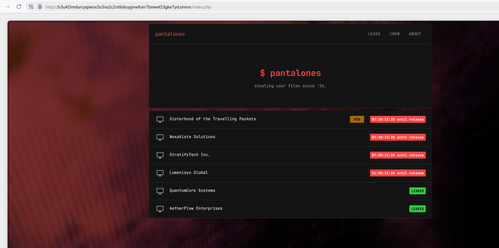

First move: View Page Source. Found a base64-encoded HTML comment sitting in the markup.

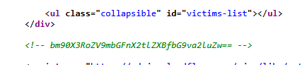

```
$ echo "bm90X3RoZV9mbGFnX2tlZXBfbG9va2luZw==" | base64 -d
not_the_flag_keep_looking
```

**Lesson:** A troll, not a lead — but confirmed the site hides things in source, worth checking every page.

**Step 2 — robots.txt**

Checked `/robots.txt`, which disallowed two paths never linked anywhere in the visible UI:

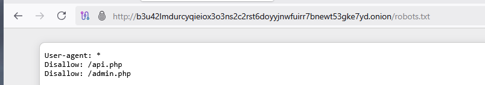

```
User-agent: *
Disallow: /api.php
Disallow: /admin.php
```

**Lesson:** Disallowing a path in `robots.txt` doesn't hide it — it announces it to anyone who checks.

**Step 3 — Mapping the API**

Hitting `/api.php` with no parameters returned a validation error that leaked the full action list:

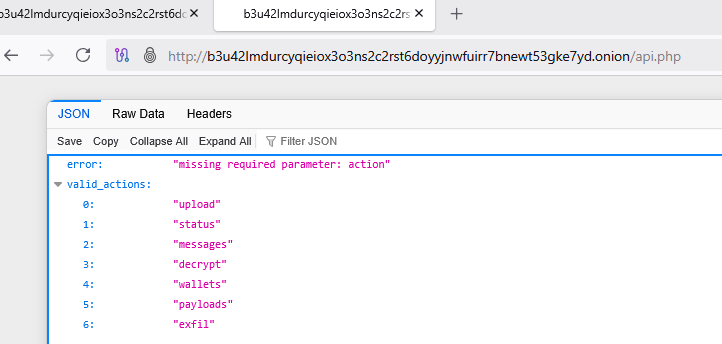

```json
{"error": "missing required parameter: action",
 "valid_actions": ["upload","status","messages","decrypt","wallets","payloads","exfil"]}
```

Walked each action to map crew activity, staged malware builds, and exfil job history:

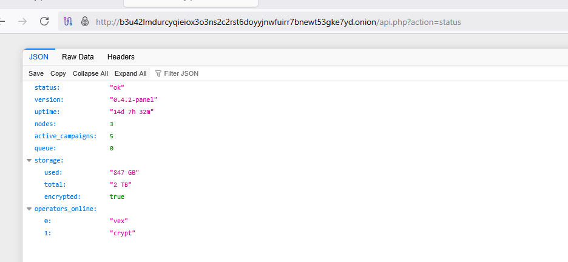
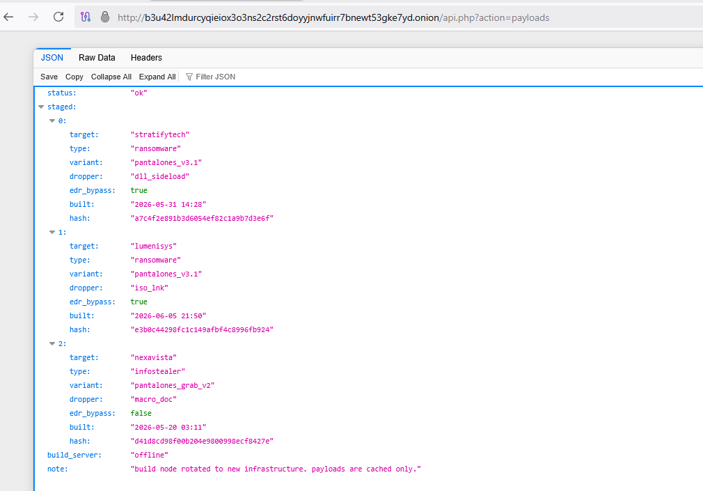
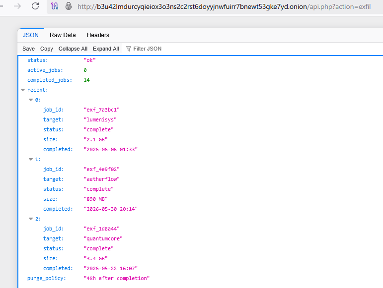

**Lesson:** Verbose API errors turn a black-box endpoint into a documented one for free.

**Step 4 — The Leaked Dotfile**

Two victims' data dumps were already downloadable. Inside one archive, a hidden dotfile (`.exfil.sh`) — easy to miss casually, not if you check for hidden files — contained the crew's own upload panel URL and API auth key in plaintext.

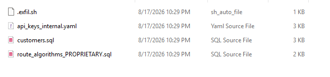
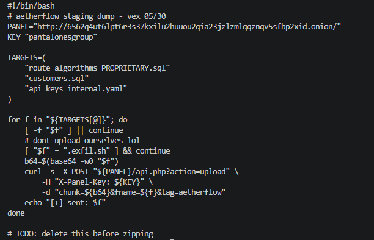

```bash
PANEL="http://6562q4ut6lpt6r3s37kxilu2huuou2qia23jzlzmlqqznqv5sfbp2xid.onion/"
KEY="pantalonesgroup"
```

**Lesson:** Automation scripts with live credentials shouldn't ship inside the data they're exfiltrating.

**Step 5 — Admin Panel (Dead End on SQLi)**

`admin.php` was a real login form. Tried crew handles as usernames, the recovered API key as a password, and standard SQLi payloads (`' OR '1'='1' -- -` and variants) in both fields — all correctly rejected.

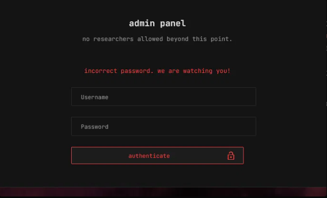

**Lesson:** Not every login form is the vulnerable one; ruling out a path is progress too.

**Step 6 — Reading the Crew's Chat Logs**

The `messages` API action needed a `conversation_id` parameter. Sequential integers worked immediately, surfacing full internal crew conversations — casual, unguarded chat between the four operators, including one explicitly warning the others that `admin.php` had no auth and being dismissed.

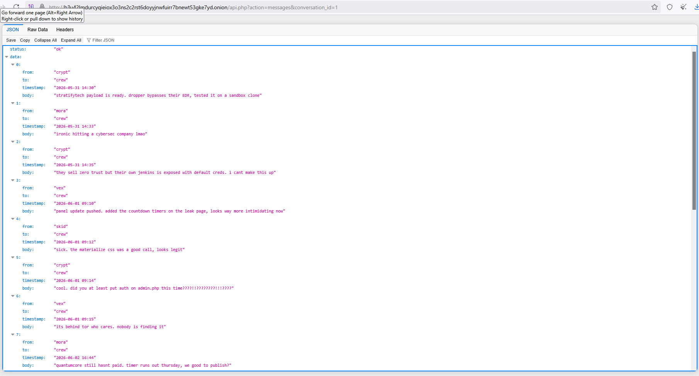

**Lesson:** Internal comms are some of the highest-value recon data once an attacker (or researcher) has any foothold.

**Step 7 — The Password Handoff**

Further into the thread, one operator asked another for a forgotten password and got it back "encoded" — base64:

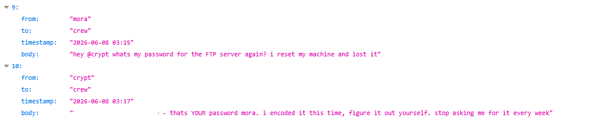

Decoded in seconds via CyberChef:

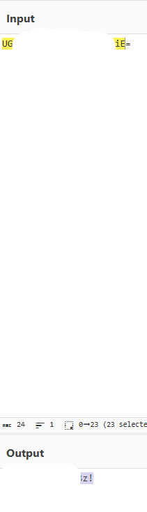

**Lesson:** Base64 is encoding, not encryption. Sharing "encoded" secrets in chat is functionally the same as sharing them in plaintext.

**Step 8 — Admin Dashboard & Flag**

Logging in with the recovered credentials opened the full operator dashboard: ransom status per victim, decryption keys, activity log, infrastructure stats. The flag sat in the decryption-key field for the researchers' own listing on the leak site — a nice meta touch.

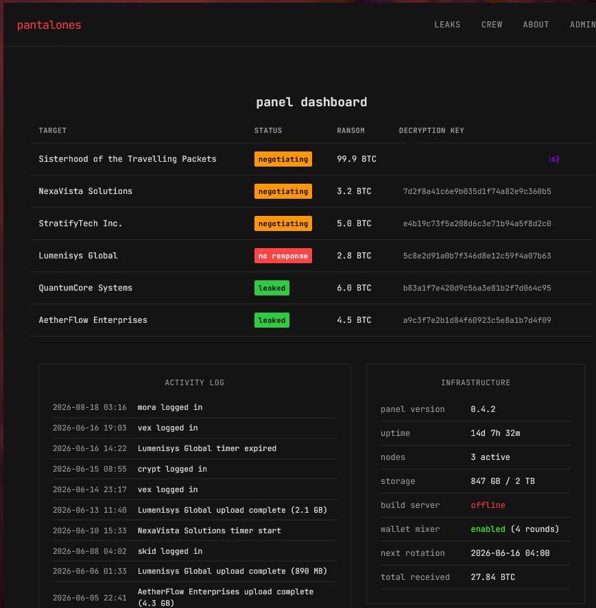

```
flare{pantal0n3s_g0t_pantsed_2026}
```

---

### 🛠️ Tools & Techniques Used

- **Tor Browser** — accessing the `.onion` challenge site
- **Browser DevTools / View Source** — page source inspection, request/response review
- **CyberChef** — Base64 decode/encode
- **VS Code / terminal** — local file inspection, quick decode verification

### 🧠 Vulnerability Classes Covered

Information disclosure · forced browsing / predictable resources · verbose error messages · sensitive data exposure (leaked files & credentials) · insecure credential sharing · broken authentication (ruled out via testing)

### 🥋 Key Takeaways

- **Check `robots.txt` and page source on everything.** Both directly led to the two most important endpoints in the challenge.
- **Verbose errors are reconnaissance gold.** The API's own error messages did most of the enumeration work for me.
- **Encoding ≠ encryption.** Base64 stopped nobody — CyberChef decoded it instantly.
- **Chat logs are an underrated attack surface.** The actual credentials came from reading how the crew talked to each other, not from brute-forcing anything.
- **Ruling out a path is still progress.** The SQLi dead-end on `admin.php` saved time by redirecting effort toward the actual intended solution.

---

*Write-up by Christopher Diaz ([@chris12x1](https://github.com/chris12x1)) — Solo, Flare × SANS × WiCyS CTF 2026.*
